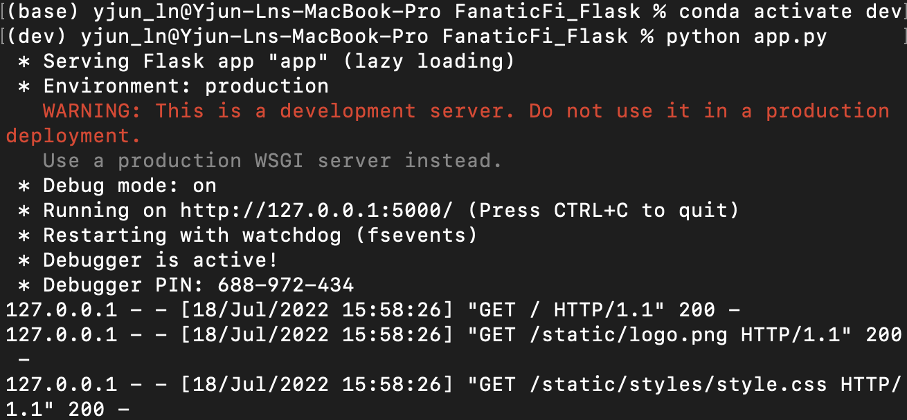

# FanaticFi_Heroku

**FanaticFi Heroku** demonstrates the deployment process of FanaticFi – NBA Draft Rank Prediction is empowered by Support Vector Machines (SVM) machine learning model using the Flask application and Heroku cloud services. This user-friendly web application is going to predict whether NBA rookie’s draft rank is within the top 15 or below based on given player’s statistics. 

---

## **Link to the web application** click [here](https://fanaticfi-heroku.herokuapp.com/)
---

**The process includes** building a machine learning model, save the model, then create an API for the model, develop HTTP templates with css styles. Utilize predictive capabilities of the machine learning model through HTTP requests using Flask on a local website and finally deploy the API to Heroku cloud.

### Section titles:

* [Technologies](#technologies)

* [App Development](#app-development)

* [App Deployment](#app-deployment)

* [Contributors](#contributors)

---

## Technologies
>This project leverages python 3.7

* [Flask](https://flask.palletsprojects.com/en/2.1.x/) - deploy web applications in Python locally

* [Pandas](https://pandas.pydata.org/) - Data analysis and manipulation

* [Pickle](https://docs.python.org/3/library/pickle.html) - Serializing and deserializing a Python object structure

* [Scikit-learn](https://scikit-learn.org/stable/install.html) - Supply machine learning tools and dependencies

* [Heroku](https://dashboard.heroku.com/apps) - Deploy application into shareable web cloud


```python
pip install Flask
pip install pandas
pip install pickle5
pip install -U scikit-learn
```

---

## App Development

* Collect data and data preprocessing
    * Data credit [Sports Reference](https://www.sports-reference.com)
    * Clean, regroup, scale, and split data to train machine learning model
    
* Develope a machine learning model and save as a pkl file
    * Choose Support Vector Machine model for binary classification
    * Save model as a pickle file for later use

---

## App Deployment

**Flask preparation and deployment**
* `app.py` uses pickle files, renders `index.html` GUI, and connects Flask
* `index.html` enables user interactive functions of the application
* `styles.css` render design and format of `index.html`

Go to the correct file directory and
**Run application using command line** under the virtual environment contains all necessary dependencies

```python
python app.py
```


Then, copy and paste the given web address http://127.0.0.1:5000/ to browser and checkout the result of the API.


**Heroku preparation and deployment**
* Create new virtual environment using

`conda create --name fanaticfi python=3.7`

* Create `Procfile` and `requirements.txt` file

```python
pip install gunicorn
echo "web: gunicorn app_basic:app" > Procfile
pip freeze > requirements.txt
```


* Commit and Push all files to GitHub

* Connect GitHub repository with Heroku


* Deploy branch to Heroku


* View application on global web page [here](https:fanaticfi-api.herokuapp.com/)


---

## Contributors

**Yanjun Lin Andrie** <span>&nbsp;&nbsp;</span> |
<span>&nbsp;&nbsp;</span> email: yanjun.lin.andrie@gmail.com <span>&nbsp;&nbsp;</span>|
<span>&nbsp;&nbsp;</span> [](https://www.linkedin.com/in/yanjun-linked/)

---

## License

[](LICENSE)
